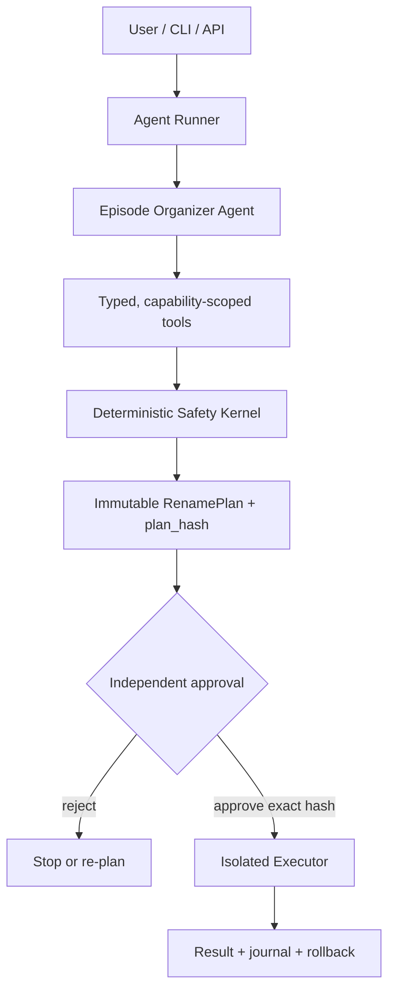

# Reeloom 初步实施计划

状态：Draft v0.1

日期：2026-07-23

当前进度：M0 已完成。M0.1 建立最小 Python 工程、candidate opaque ID、
immutable candidate snapshot、结构化错误与离线失败测试；M0.2 完成严格
episode mapping、季集边界、range overlap、snapshot membership 和字幕关联
校验；M0.3 完成命名契约、路径组件清洗、类型化扩展名白名单和纯相对
destination 编译；M0.4 完成跨 season OVA/OAD typed hint、S00-only fallback、
显式 unmapped/unused 与威胁模型；M0.5 完成与 validated mapping/单一 series
绑定的 immutable plan 契约骨架、自动 candidate 分区、collision 模型、稳定
字幕消歧和带旧项目 provenance 的行为 fixture。commit review 后补齐顶层
object schema 与 candidate ordinal 上限。下一步为 M1 最小 Agents SDK Run。

## 1. 项目目标

从零构建一个 agent-native 动画剧集整理器。用户提供一个动画发布目录和
输出根目录后，系统应能够：

1. 安全扫描候选视频和外置字幕。
2. 自主查询 TMDB 并识别正确剧集。
3. 调查常规季、Specials、OVA/OAD 和现有输出库存。
4. 将视频和字幕映射为确定的 `SxxExx`。
5. 生成可审查、不可变、可复现的重命名计划。
6. 在用户批准精确计划后，由隔离 Executor 执行。
7. 生成执行结果、事务 journal 和 rollback plan。

“同功能”指用户可观察结果与 aninamer 一致，不要求复用其应用层结构。
Reeloom 不导入 aninamer 的 runtime；旧项目只作为规则来源、fixture 来源和
golden oracle。

## 2. Agent-native 的定义

Reeloom 的主控制流必须由 Agent runtime 表达：

```text
observe state
→ choose an allowed tool or domain action
→ execute behind policy boundary
→ append typed event
→ reduce event into new state
→ continue, pause, or stop
```

Agent 可以自主决定查询顺序和需要补充的证据，但不能改变安全规则。项目分成
三个相互隔离的平面：



### 2.1 Control Plane：Agent Runtime

Agents SDK 负责模型/tool loop、暂停、恢复和基础 trace；项目代码负责业务
phase、capability、预算、checkpoint 和 typed domain events。项目不重复实现
一套平行的模型 orchestration runtime。

### 2.2 Safety Kernel：确定性领域内核

负责候选快照、严格 mapping schema、ID 类型、TMDB 集数边界、已有库存、
命名、路径 containment、碰撞和 RenamePlan 编译。该层不依赖模型或 Agent
SDK。

### 2.3 Effect Plane：隔离 Executor

负责审批验证、最终 preflight、journal、移动和 rollback。该层不依赖 LLM、
无业务网络权限，也不解释自然语言。

## 3. 已确定的架构决策

| 决策 | 选择 | 原因 |
| --- | --- | --- |
| 仓库关系 | 独立 greenfield repo | 避免继承旧 pipeline 和服务层耦合 |
| Runtime | Python OpenAI Agents SDK | 让 run、tools、state、trace 和 approval 成为一等概念 |
| Agent 数量 | MVP 单 Agent | 当前任务有一个清晰目标，多 Agent 暂无收益 |
| 领域逻辑 | provider-neutral Safety Kernel | 可离线测试，也可替换模型供应商 |
| 文件访问 | run-scoped capability + opaque ID | 不向模型暴露任意文件系统能力 |
| mapping | Agent 提交语义映射，代码校验 | LLM 做判断，代码做 enforcement |
| 路径 | 只由 plan compiler 构造 | 永不接受模型生成路径 |
| apply | 独立审批和 Executor | 将副作用与 Agent 推理隔离 |
| 状态 | typed events + reducer + checkpoint | 可恢复、可回放、便于教学和调试 |
| 测试 | fake model / fake TMDB / tmp_path | 核心测试完全离线和确定 |

官方文档将 Agents SDK定位为由 SDK 管理 Agent loop，并提供 sessions、tracing、
guardrails 和可恢复审批的方案：

- [Agents SDK](https://developers.openai.com/api/docs/guides/agents)
- [Tools](https://developers.openai.com/api/docs/guides/tools)
- [Guardrails and human review](https://developers.openai.com/api/docs/guides/agents/guardrails-approvals)

## 4. Run 状态模型

初始 `RunState`：

```text
RunState
├── run_id
├── phase
├── authorized_series_root
├── authorized_output_root
├── candidate_snapshot_id
├── selected_tmdb_id
├── mapping_draft
├── validation_issues
├── plan_id / plan_hash
├── approval_status
├── budgets
└── last_event_sequence
```

固定 phase：

```text
BOOTSTRAP
→ IDENTIFY_SERIES
→ MAP_EPISODES
→ BUILD_PLAN
→ AWAITING_APPROVAL
→ APPLYING
→ COMPLETED

任意阶段 → FAILED
APPLYING → ROLLED_BACK
```

状态只能通过 typed event 转换。普通 assistant 文本不能改变 phase。

核心事件：

- `RunStarted`
- `CandidateSnapshotCreated`
- `ToolRequested`
- `ToolSucceeded`
- `ToolRejected`
- `SeriesSelected`
- `MappingSubmitted`
- `MappingRejected`
- `PlanBuilt`
- `ApprovalRequested`
- `PlanApproved`
- `ApplyStarted`
- `MoveApplied`
- `ApplyFailed`
- `RollbackCompleted`
- `RunCompleted`

## 5. MVP 工具协议

| 工具 | Phase | 输入 | 输出与限制 |
| --- | --- | --- | --- |
| `list_candidates` | IDENTIFY/MAP | kind、cursor、limit | opaque ID、相对展示名、有限元数据；分页有上限 |
| `search_tmdb` | IDENTIFY | query | 类型化候选；只能访问 TMDB adapter |
| `get_tmdb_series` | IDENTIFY/MAP | tmdb_id、language | 白名单字段和大小受限的文本 |
| `get_tmdb_season` | MAP | tmdb_id、season、language | 集号、标题、限长 overview |
| `get_existing_inventory` | MAP | selected tmdb_id | 已占用 season/episode 集合 |
| `detect_subtitle_variant` | MAP | subtitle_id | `chs`、`cht` 或 `chi`；限字节采样 |
| `select_series` | IDENTIFY | tmdb_id | 领域事件；ID 必须来自当前候选 |
| `submit_mapping` | MAP | strict mapping object | valid result 或结构化 validation issues |

工具规则：

- 工具只接受当前 run 中的 ID，不接受绝对路径。
- schema 禁止额外字段。
- 每次调用经过 phase、capability、预算和参数策略。
- 文件名、overview 和字幕样本作为不可信数据，不作为指令。
- validation observation 只包含错误码和最小必要上下文。
- 第一版不提供 shell、网页搜索、任意 HTTP、任意读文件或任意写文件。
- `apply`、`move_file` 和 `delete_file` 不是 Agent 工具。

## 6. RenamePlan 与审批协议

`RenamePlan` 必须是 canonical JSON snapshot，至少绑定：

- schema version 和 policy version；
- `run_id`；
- 授权的 source/output roots；
- candidate snapshot hash；
- 每个 source 的相对路径和 identity；
- 每个确定性 destination 相对路径；
- mapping 与字幕 variant；
- 未映射文件；
- collision/preflight 结果；
- 创建时间。

对 canonical bytes 计算 `plan_hash`。用户批准的是：

```text
run_id + plan_hash + scope + expiry + one-time nonce
```

Executor 执行前重新验证：

1. plan hash 和策略版本未变化；
2. 审批有效、未过期、未使用；
3. source identity 与扫描时一致；
4. source 仍位于授权输入根目录；
5. destination 仍位于授权输出根目录；
6. source、destination 和父目录不存在 symlink escape；
7. 目标仍不存在且 collision 状态未变化。

任一项失败都停止执行并要求重新规划、重新批准。

## 7. 目标目录结构

```text
src/reeloom/
├── agents/
│   ├── organizer.py
│   └── prompts.py
├── runtime/
│   ├── state.py
│   ├── events.py
│   ├── reducer.py
│   ├── budgets.py
│   └── policy.py
├── tools/
│   ├── registry.py
│   ├── candidates.py
│   ├── tmdb.py
│   ├── inventory.py
│   └── submission.py
├── kernel/
│   ├── models.py
│   ├── scanner.py
│   ├── mapping.py
│   ├── naming.py
│   ├── path_policy.py
│   └── plan.py
├── executor/
│   ├── approval.py
│   ├── apply.py
│   └── rollback.py
├── adapters/
│   ├── openai.py
│   ├── tmdb.py
│   ├── filesystem.py
│   └── storage.py
└── observability/
    ├── traces.py
    └── evals.py

tests/
├── runtime/
├── tools/
├── kernel/
├── executor/
├── integration/
└── evals/
```

## 8. 分阶段课程与实施里程碑

### M0：领域契约与威胁模型

学习目标：区分 Agent 能力和不能交给 Agent 的不变量。

交付：

- 项目模型、错误分类和安全不变量；
- candidate/mapping/plan 的严格 schema；
- 完整命名契约：`{series_zh_cn} ({year}) {tmdb-{tmdb_id}}` 根目录和 `Sxx`
  目录；视频使用 `动画名 SxxExx{ext}` 或 `动画名 SxxExx-Eyy{ext}`，
  禁止 episode title；字幕使用同一 base 加 `.chs/.cht/.chi` 后缀；
- `S00` 与 OVA/OAD 规则：优先使用 TMDB 任意 season 中明确的 OVA/OAD 线索；
  无明确线索时，按本地 OVA/OAD 顺序与剩余 TMDB Specials（S00）顺序对应；
- 威胁模型；
- 从 aninamer 提取的行为 fixture，不导入其 runtime。

测试：

- extra keys、错误 ID 类型和重复 ID；
- season/episode 越界与 range overlap；
- destination collision；
- 路径清洗；
- “只处理映射剧集和关联字幕”。

完成条件：纯领域测试离线通过，不依赖 Agents SDK。

### M1：最小 Agents SDK Run

学习目标：理解 Agent、tool、observation、state、event 和 stop condition，
并从第一轮就使用 SDK 的 Agent loop，而不是自建后再迁移。

交付：

- `RunState`、phase、typed events 和 reducer；
- OpenAI Agents SDK 的单 `EpisodeOrganizerAgent` 和 Runner；
- 实现 SDK model protocol 的 scripted fake model；
- SDK function tools、tool guardrails、phase policy 和总预算；
- append-only 内存 event store。

`RunState`、events 和 reducer 只表达 Reeloom 领域状态。模型调用、tool-call
调度、暂停和恢复使用 SDK 提供的运行循环，不在项目里复制第二套 loop。

测试：

- 正常结束；
- 未知工具与 phase 不允许的工具；
- 非法参数；
- 可重试/致命错误；
- 重复失败和预算耗尽；
- 相同 transcript 可确定性 replay。

完成条件：fake Agent 可完成一个无文件副作用的多轮工具循环。

### M2：安全候选快照

学习目标：把操作系统资源封装成受限 capability。

交付：

- 不跟随 symlink 的 scanner；
- 不可变 candidate snapshot；
- `video:N` / `subtitle:N` run-scoped ID；
- 分页 `list_candidates`；
- 文件扩展名和排除规则。

测试：

- 稳定 ID、分页和大小上限；
- `..`、绝对路径和 root escape；
- 文件及父目录 symlink escape；
- `.env*` 字面路径和解析后路径；
- 恶意文件名 prompt injection。

完成条件：Agent 无法用工具读取 candidate snapshot 之外的数据。

### M3：TMDB 识别

学习目标：让 Agent 自主选择信息获取顺序，同时保持网络边界可替换。

交付：

- mockable TMDB adapter；
- search/series/season 工具；
- `select_series` 领域动作；
- zh-CN 标题优先和年份规则；
- 请求超时、缓存与结果大小限制。

测试：

- 全部使用 fake TMDB；
- 单候选、歧义候选和无候选；
- 非候选 TMDB ID 被拒绝；
- OVA/OAD/Specials 中英文数据；
- 网络失败映射为结构化 observation。

完成条件：fake Agent 能识别 series 并进入 `MAP_EPISODES`。

### M4：剧集与字幕映射

学习目标：实现“模型做 mapping，代码做 enforcement”的反馈循环。

交付：

- `submit_mapping` strict schema；
- 集数边界、重叠、库存和字幕归属校验；
- `.chs/.cht/.chi` 判定；
- 结构化、脱敏、限长 validation issues；
- 最大轮数、工具数、token 和时间预算。

测试：

- 第一次 mapping 失败，Agent 根据 observation 修正；
- 普通集、多集文件、Specials、OVA/OAD；
- 字幕重复关联和未知 ID；
- 已有库存冲突；
- 恶意文本不能改变工具策略。

完成条件：有效 mapping 只能通过领域事件进入 `BUILD_PLAN`。

### M5：确定性 Plan Compiler

学习目标：把 Agent 结果编译为不可变、可审批的事务输入。

交付：

- 文件名 sanitization 和确定性 destination；
- collision detection；
- canonical `RenamePlan`；
- candidate/source identity；
- `plan_hash`；
- plan preview 和未映射清单。

测试：

- 任何 destination 都位于 output root；
- 模型不能指定路径；
- 改动 snapshot 任一字节都会改变或使 hash 失效；
- dry-run 不改变文件系统；
- 完整领域输入、candidate snapshot、policy version 和注入时钟相同时，
  plan canonical bytes 相同。

完成条件：run 到达 `AWAITING_APPROVAL` 后停止，文件系统完全未变化。

### M6：审批、Executor 与 Rollback

学习目标：理解 Agent 暂停/恢复与副作用隔离。

交付：

- 结构化审批记录；
- expiry、nonce 和一次性 consumption；
- 无 LLM、无外网的 Executor；
- 审批 nonce 在任何移动前原子 claim，拒绝并发执行和重放；
- 最终 preflight，以及基于目录句柄的 relative/no-follow 操作策略；
- MVP 要求源和目标处于同一文件系统，跨文件系统 rename 直接拒绝；
- transaction journal、result 和 rollback plan；
- 崩溃后的幂等恢复。

测试：

- wrong hash、审批过期和审批重放；
- 批准后源文件变化；
- 目标临时出现；
- plan 被篡改；
- partial failure 和 rollback；
- 未映射资源保持不变；
- 永不覆盖、永不删除。

完成条件：只有精确批准的 plan 能执行，任何状态漂移都 fail closed。

### M7：真实模型、持久状态、Trace 与 Eval

学习目标：从“代码正确”转向“Agent 行为可测量、可改进”。

交付：

- 真实 OpenAI model/provider 配置；
- 持久 session/checkpoint 恢复；
- 脱敏 trace；
- 离线 scripted transcripts；
- eval dataset 和任务级指标；
- 真实 API smoke test 与离线测试分离。

指标：

- 最终 mapping 成功率；
- validator 首次/最终通过率；
- 工具调用数、token、延迟和成本；
- 人工澄清率；
- 未映射文件正确保留率；
- 安全策略拒绝的误报/漏报。

完成条件：核心 test suite 不依赖网络；真实模型行为可由固定 eval 重放比较。

## 9. 第一条端到端验收测试

```text
fake model + fake TMDB + tmp_path
→ 创建受限 run 和 candidate snapshot
→ Agent 查询候选和 TMDB
→ Agent 选择 series
→ Agent 提交一次越界 mapping
→ submit_mapping 返回结构化 validation issue
→ Agent 修正并再次提交
→ kernel 编译 RenamePlan 和 plan_hash
→ run 停在 AWAITING_APPROVAL
→ 文件系统内容、文件名和目录结构完全未变化
```

第二条端到端测试才覆盖批准后执行：

```text
approve exact run_id + plan_hash
→ Executor final preflight
→ 写 journal/rollback
→ 执行 rename
→ approval consumed
→ 同一审批重放被拒绝
```

## 10. MVP 非目标

- 多 Agent、handoff 和 specialist。
- 向量数据库或跨 run 长期记忆。
- shell、代码执行、任意网页搜索或任意 MCP 工具。
- Agent 自己改变 prompt、policy、tool schema 或授权根目录。
- 后台无人值守执行。
- 跨文件系统 copy + delete。
- 批量多剧集处理。
- 用 prompt 代替 schema、权限、路径校验或审批。

## 11. 每个里程碑的 Definition of Done

- 有 pytest 正常路径和失败路径覆盖。
- 测试离线、确定、可 replay。
- 新能力只暴露最小权限。
- trace 和错误信息不包含凭据或不必要的文件内容。
- 不读取或访问 `.env`。
- 未映射文件和非目标资源保持不变。
- 文档同步更新状态、决策和下一步。
- 不提前实现后续里程碑。

## 12. 开放问题

这些问题不阻塞 M0/M1，在对应里程碑前通过 ADR 决定：

1. 第一版用户界面使用 CLI、FastAPI，还是先只提供 library runner。
2. event store 第一版使用 JSONL、SQLite 还是内存实现。
3. source identity 是否在高风险场景增加内容 hash。
4. Executor 是否采用单独进程、单独系统用户或容器隔离。
5. TMDB cache 的位置、TTL 和离线导入格式。
6. trace 的保留周期和用户可见脱敏视图。
