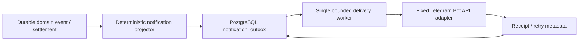

# M12：Telegram 出站通知计划

状态：M12.0 已完成；M12.1-M12.3 计划中

日期：2026-08-01

## 1. 目标

在不改变 Agent、RenamePlan、审批或 Executor 语义的前提下，为管理员提供精简的
Telegram 单向通知。样式参考 ani-rss 的 `sendPhoto + caption`：优先发送 TMDB
海报和短文本，没有海报时降级为纯文本。

通知只投影已经持久化的领域事实，不接受 Agent 自由文本、文件路径、异常堆栈或
任意 URL。Telegram 不是控制面；第一版没有 bot command、inline keyboard、批准
按钮或双向聊天。

## 2. 固定通知类型

| 类型 | 触发事实 | 目的 |
| --- | --- | --- |
| `plan_ready` | 新 immutable plan 已持久化并等待批准 | 提醒审查计划 |
| `archive_completed` | 媒体事务与适用的文件夹收尾均已结算 | 报告完成结果 |
| `attention_required` | 确定性失败或恢复状态需要管理员处理 | 报告最小、可行动上下文 |
| `test` | 管理员显式测试通知配置 | 验证通道；使用完全固定文本 |

revision/reapply 产生的新 plan 仍归一为 `plan_ready`，但 dedupe key 必须包含新的
`plan_hash`。媒体事务完成而 folder disposition 尚未结算时，不提前生成
`archive_completed`。

## 3. 固定样式

### 3.1 计划待批准

```text
🧶 Reeloom · 计划待批准

葬送的芙莉莲 (2023)
范围：S01E01–E04
媒体：4 视频 · 4 字幕
未映射：1
计划：aaaaaaaa…
TMDB · TV 209867
```

### 3.2 整理完成

```text
✅ Reeloom · 整理完成

葬送的芙莉莲 (2023)
已移动：8
未映射：1，仍保留原位
文件夹：已归入 archive
事务：txn-7f31
TMDB · TV 209867
```

### 3.3 需要处理

```text
⚠️ Reeloom · 需要处理

葬送的芙莉莲 (2023)
阶段：Preflight
原因：目标已存在
结果：未覆盖目标，源内容保持不变
下一步：请在 Reeloom 中审查或恢复
事件：evt-a8c2
TMDB · TV 209867
```

真实 caption 使用 Telegram `MarkdownV2`：标题加粗、ID 使用 inline code、TMDB
条目使用固定目的地链接。所有动态文本在渲染时统一转义。

## 4. 架构



投影器只读取稳定 ID、计数、枚举结果、选定 TMDB identity 和受控 poster ref。
它不读取媒体文件，不接收路径，也不请求网络。Worker 不属于 Agent tool，不能
改变 run、plan、approval、journal 或 filesystem 状态。

## 5. PostgreSQL outbox 设计（M12.1）

计划表 `notification_outbox` 的最小字段：

| 字段 | 约束 |
| --- | --- |
| `notification_id` | 服务端生成的 opaque ID，主键 |
| `dedupe_key` | 稳定、唯一；绑定 notification type 与 durable fact identity |
| `notification_type` | 四种 closed enum 之一 |
| `schema_version` | 首版固定为 1 |
| `payload_json` | 严格解析的最小 JSON；拒绝 extra keys |
| `state` | `queued / leased / retry_wait / sent / dead` |
| `attempt_count` | 有界非负整数 |
| `available_at` | 下一次可 claim 时间 |
| `lease_owner / lease_expires_at` | worker fencing 与崩溃恢复 |
| `telegram_message_id` | 成功 receipt；nullable |
| `last_error_code` | 有界枚举，不存响应正文 |
| timestamps | 审计与运维 |

生产者在持久化对应领域事实的同一 PostgreSQL 事务中 `INSERT ... ON CONFLICT DO
NOTHING`。Worker 使用 `FOR UPDATE SKIP LOCKED` claim，短事务获得 lease 后再做
HTTP；网络请求期间不持有数据库事务。

启动时回收过期 lease；`429` 尊重服务端 `retry_after`，连接错误、超时和 `5xx`
使用带 jitter 的有界指数退避，永久 `4xx` 和耗尽尝试进入 `dead`。Telegram Bot
API 不提供调用方幂等键，因此语义是 at-least-once；稳定 `dedupe_key` 能消除本地
重复生产，但发送成功后进程在 receipt 落库前崩溃仍可能出现一条重复通知。该残余
风险必须在 UI/指标中可见，不能宣称 exactly-once。

## 6. Telegram adapter（M12.2）

- 目的地固定为 `https://api.telegram.org`，不接受 base URL 覆盖、redirect 或
  proxy URL；
- bot token 和 chat ID 只由 Admin secret/config 边界提供，write-only、脱敏；
- 有 poster 时调用 `sendPhoto`，caption 最大 900 bytes；没有 poster 时调用
  `sendMessage`；
- poster URL 只能由固定 TMDB image host 加校验后的 `TmdbPosterRef` 构造；
- 固定连接/读取/总超时、响应大小和并发为 1；
- 不记录 token、完整请求 URL、响应正文、caption 或 title；
- 测试使用 scripted fake transport，pytest 永不访问网络。

M12.2 会新增 Telegram 业务网络适配器，与当前“TMDB 是唯一允许的业务网络
适配器”安全不变量冲突。在该不变量通过独立评审并显式修改前，不实现或启用真实
Telegram HTTP。

## 7. 分步交付

### M12.0：纯合同与固定渲染（已完成）

- closed notification enums 和 frozen payload；
- 受控 `TmdbPosterRef` 与固定 TMDB URL 构造；
- MarkdownV2 全保留字符转义；
- 三种正式样式及 field-free 测试样式；
- 900-byte caption 上限和失败路径测试；
- 计划、威胁模型、requirements 与 ADR。

### M12.1：PostgreSQL durable outbox

- migration、严格 codec、repository 和状态机；
- dedupe、claim、lease 回收、retry/dead；
- fake sender；并发与重启测试；
- 不包含真实 Telegram 网络。

### M12.2：固定 Telegram transport

- 仅在安全不变量明确授权后实施；
- fixed-host adapter、secret/config、fake HTTP 合同测试；
- `sendPhoto` / `sendMessage` 降级和 receipt 分类。

### M12.3：领域事件集成与运维

- 绑定 plan、execution 和 folder settlement 的确定触发点；
- 后台 worker 生命周期、health、metrics、Admin test action；
- 容器配置和离线生产旅程测试。

## 8. 非目标

- Telegram 入站 webhook、命令和审批；
- 任意模板、Jinja、用户 HTML 或自定义 Markdown；
- 任意图片 URL、媒体文件上传或本地文件读取；
- 把发送成功解释为 run/plan/execution 成功；
- 由 Agent 或 Executor 直接调用 Telegram。
