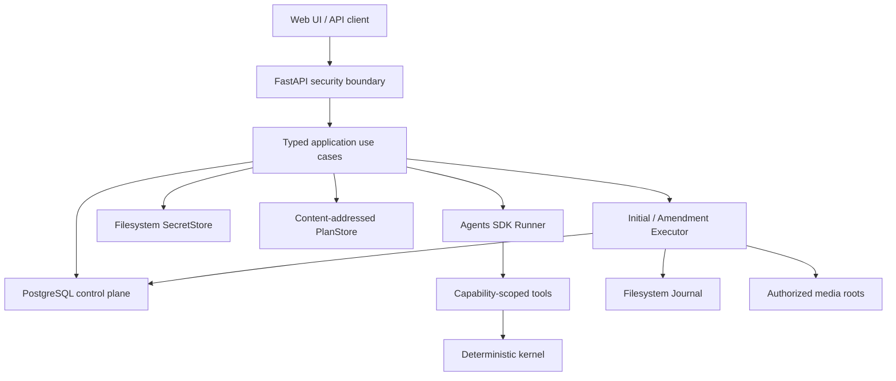

# M8 计划：PostgreSQL-first 服务器控制面

状态：Approved for implementation

日期：2026-07-24

基线：M0-M7（`a0cc6e9`）

## 1. 目标

M8 为后续可交互 Web 前端建立可部署的服务器后端。用户可以管理监听目录和归档
路由、观察 run、与原 Agent 继续交互、修订计划、批准执行，并在已完成布局上
发起安全的 reapply。

M8 不再沿用“先实现 filesystem 控制面，再迁移 PostgreSQL”的路线。从第一个
增量开始：

- PostgreSQL 17 是控制面元数据的唯一事实来源；
- 文件系统只拥有媒体、write-only Secret、content-addressed Plan 和 Executor
  Journal；
- 每类状态只有一个 owner，不建立 backend toggle、fallback 或 dual-write；
- 每个 use case 只跨一个短数据库事务，或一个明确的 filesystem journal；
- Agent、TMDB、扫描和 rename 都在数据库事务之外运行。

前端本身不在 M8 实现。M8 完成时，前端所需的稳定 API、SSE、认证和 production
composition 必须已经可用。

## 2. 为什么重做

上一版 M8 参考实现证明了 question、revision、reapply、approval 和 recovery 的
主要行为，但内部实现同时引入了多套 append-only filesystem store、全量 replay、
job/operation lease、跨 Store staged publication 和大量 crash-window 补偿。

主要问题不是测试数量，而是需要证明的状态组合过多：

- unchanged poll 仍会持久化完整 observation 历史；
- 普通查询、reconciler 和 SSE 依赖 replay；
- interaction、runtime、session、plan head 和 approval 分属不同 Store；
- 单进程部署却维护两套 TTL/heartbeat lease；
- 相同安全行为在 adapter、service、API 和 E2E 重复搭建。

重做的目标是保留已确认的产品语义，删除制造这些组合的内部机制。

## 3. 范围

### 3.1 交付

1. PostgreSQL migration、pool、health、单实例锁和真实数据库测试入口。
2. 版本化服务器配置：
   - watch root；
   - archive route；
   - `anime`、`tv`、`movie` work type；
   - poll/settle interval；
   - provider `base_url`、model、reasoning effort、verbosity；
   - write-only API key；
   - `plan_only`、`manual`、`automatic` apply policy。
3. no-follow watcher、bounded current observations、stable discovery、run/job registry。
4. 初始 Episode Organizer Agent run、SDK session、预算、event 和 immutable plan。
5. run/config/plan/event HTTP API 与 browser-safe SSE。
6. 在原 logical Agent/session 上：
   - `question`：领域只读；
   - `revision`：对未执行 plan 追加人工纠正并 fresh 提交完整 mapping；
   - `reapply`：对 completed layout fresh 提交完整 mapping，生成独立 amendment。
7. manual/automatic 共用的 exact approval、一次性 claim、apply、rollback 和
   deterministic recovery。
8. 单实例 production composition、启动 reconcile 和 graceful shutdown。

### 3.2 非目标

- Web UI；
- 多 worker、多进程或多主机；
- 任意 SQL、URL、shell、文件读取或目录遍历 Agent tool；
- 把 Secret、Plan 或 Journal 迁入 PostgreSQL；
- filesystem/PostgreSQL runtime 切换或旧 M8 importer；
- 跨文件系统 copy + delete；
- 一个 run 同时整理多个作品；
- 在 movie mapping 领域契约完成前用 episode mapping 代替 movie。

## 4. 不可变安全边界

M0-M7 的安全不变量继续成立，并增加：

1. 配置只由 authenticated admin 修改。Agent、文件名、prompt 和普通 run API
   不能提交 path、URL、secret、model 或 apply policy。
2. run 只保存 exact config revision 和 opaque capability；更新配置不改变已启动
   run 的授权。
3. API key 永远 write-only，不进入 PostgreSQL、HTTP read response、event、
   session、trace、日志或错误。
4. 自定义 provider 必须匹配 deployment origin allowlist；禁止 redirect、
   environment proxy 和 DNS rebinding。它只承载 SDK model 请求，不成为 Agent
   HTTP tool。
5. question 文本和 assistant reply 不能改变 run phase、mapping、plan 或 approval。
6. revision/reapply 必须由原 Agent 在同一 session fresh 调用 `submit_mapping`；
   人工反馈不能直接产生 path、move 或已验证领域对象。
7. automatic policy 仍签发与 manual 相同的 exact `ApprovalRecord`；Agent、自然
   语言和模型 confidence 没有批准能力。
8. Executor 不调用 LLM、不解释反馈、不接受新路径，只消费 persisted plan hash
   和 approval ID。
9. apply 前重验 plan、approval、roots、source identity、symlink、collision 和
   target absence；journal 先于 rename，目标永不覆盖。
10. DB/schema/lock/identity/commit outcome 不确定时 fail closed。

## 5. 目标架构



### 5.1 数据 owner

| 数据 | 唯一 owner |
| --- | --- |
| config revision/head、watch、observation、discovery、run、job | PostgreSQL |
| runtime event/projection、budget、SDK session batch | PostgreSQL |
| interaction、plan lineage/head、completed-layout head | PostgreSQL |
| approval、claim、settlement | PostgreSQL |
| provider secret bytes | filesystem SecretStore |
| RenamePlan/AmendmentPlan bytes | filesystem PlanStore |
| apply/rollback progress | filesystem Journal |
| media | authorized filesystem roots |

### 5.2 最小数据库模型

```text
schema_migrations
service_boots

config_revisions
config_heads

watch_states
watch_observations
discoveries
runs
jobs
scheduler_audit

run_states
run_events
agent_sessions
agent_session_batches
interactions
plan_lineage
completed_layouts

approvals
approval_claims
approval_settlements
```

历史表 append-only。唯一 mutable head 只存在于 `config_heads`、`watch_states`、
`jobs`、`run_states` 和 `agent_sessions` 等明确 projection row。plan/session/
layout 的 current ref 不在文件系统保存第二份。

### 5.3 窄事务接口

不建立通用 Repository、ORM entity graph 或跨层 `UnitOfWork`。application 只依赖
按 use case 命名的原子操作，例如：

```text
ConfigRepository.compare_and_append
SchedulerRepository.reconcile_poll
SchedulerRepository.register_run
JobRepository.claim
RuntimeRepository.append_and_project
InteractionRepository.reserve
InteractionRepository.finalize
ApprovalRepository.issue
ApprovalRepository.claim
ApprovalRepository.settle
```

connection、transaction runner、SQL retry 和 row mapping 都属于 adapter 内部。

## 6. 核心协议

### 6.1 Poll

1. 读取 exact watch revision。
2. 在事务外 no-follow 扫描。
3. 短事务重新验证 revision/fence。
4. 只写新增、变化、消失的 current observation。
5. unchanged observation 不执行 INSERT/UPDATE/DELETE；unchanged poll 不新增
   audit。
6. stable discovery 等有意义转换才追加 audit。

因此持久规模是 `O(current observations + meaningful transitions)`，不是
`O(polls × observations)`。

### 6.2 Agent 与 interaction

logical Agent identity：

```text
run_id
+ SDK session_id
+ content-addressed AgentDefinitionRevision
+ exact provider/config revision
+ append-only run/interaction/session history
```

模型调用前，`reserve` 原子验证 current head、session revision、idempotency key
和预算并建立 active interaction；事务立即结束。

模型调用使用 Agents SDK Runner 和 buffered session，在事务外执行。plan 先写入
content-addressed PlanStore。`finalize` 在一个短事务中原子提交：

- typed run event 和 current projection；
- interaction terminal result；
- session batch/head；
- usage/budget settlement；
- plan/amendment lineage 与新的 current head。

commit 后响应丢失时，重试返回 terminal result，不再次调用模型。模型失败或
服务重启时，只有 typed reconciler 可以终止未完成 reservation。

### 6.3 Approval 与 apply

approval lifecycle 使用 immutable rows：

```text
approvals
approval_claims
approval_settlements
```

`approval_claims.approval_id` 唯一。Executor 顺序：

```text
global mutation gate
→ exact archive-route gate
→ root revalidation
→ plan load
→ inert journal header + fsync
→ exact DB claim
→ preflight
→ rename / rollback
→ terminal journal + fsync
→ DB settlement
```

claim commit 不确定时，必须查询 exact claim 消歧；确认前不移动任何文件。数据库
事务不跨 rename。terminal journal 已存在而数据库不可用时，recovery 只补
settlement，不调用 Agent。

### 6.4 Revision 与 reapply

- `revision` 只允许尚未 issue approval 的 current initial plan。
- 每次 revision fresh 提交完整 mapping，生成下一版 immutable RenamePlan；旧
  plan 和 lineage 不变，旧 approval 不继承。
- completed run 不走 revision，而走 `reapply`。
- reapply 恢复同一 logical Agent/session，基于 current completed layout 和当前
  archived file identity fresh 提交完整 mapping。
- deterministic compiler 只生成最小 AmendmentPlan；无布局变化只结算 interaction，
  不产生空 approval 或 transaction。
- crash `recover` 始终无 LLM，不能退化为 revision/reapply。

## 7. 部署与数据库边界

- 固定 PostgreSQL 17 和 psycopg 3 connection pool。
- CI 提供固定 PG 17 service；测试不在运行时下载 image。
- 真实数据库 runner 只读取显式 `REELOOM_TEST_POSTGRES_DSN`，不读取 `.env*`。
- application DSN 来自 deployment-only settings，不进入普通 config API。
- migration 使用独立权限并校验 version/checksum；application role 不能
  UPDATE/DELETE immutable history。
- 一条 pool 外的 lifetime advisory-lock connection 配合 state-root process lock。
- server 生成并持久注册 boot ID；首版固定一个进程、一个 worker。
- 同 run 使用进程内 `asyncio.Lock` 和数据库 `active_operation`，不实现 TTL
  heartbeat lease。
- DB transaction 不跨 scan、TMDB、Agent、Secret/Plan write、journal fsync 或
  filesystem mutation。

## 8. HTTP 边界

M8 使用单一 deployment Admin Bearer credential；不使用角色层级、Cookie 或
query token。所有受保护 API 具有相同认证边界。

API 只暴露 typed JSON 和 opaque IDs：

```text
/api/v1/admin/config/*
/api/v1/discoveries
/api/v1/runs
/api/v1/runs/{run_id}
/api/v1/runs/{run_id}/plan
/api/v1/runs/{run_id}/events
/api/v1/runs/{run_id}/interactions
/api/v1/runs/{run_id}/approve-and-apply
/api/v1/runs/{run_id}/reapply
/api/v1/operations/runs/{run_id}/recover
```

要求：

- exact Host/Origin/CORS；
- strict JSON、duplicate-key rejection、body/text/page limits；
- authentication 前后均有有界 rate/concurrency；
- mutation 使用 idempotency key 与 expected revision/ETag；
- error、event 和 SSE 是 browser-safe allowlist projection；
- SSE 从 durable event ID 恢复，空 poll 是固定次数 indexed query；
- response、日志和 trace 不包含 secret、DSN、绝对 path 或人工消息。

## 9. 分阶段实现

每个阶段按同一顺序：

```text
requirement / failing contract
→ minimal implementation
→ all consumers
→ related integration test
→ full offline + PostgreSQL suite
→ review
→ one focused commit
```

不提前实现后续阶段，不提交无法启动的 dual-owner 中间态。

### M8.0：PostgreSQL foundation

交付：

- ADR：owner、事务、数据库 TCB、单实例、no dual-write；
- psycopg pool、deployment settings、migration/checksum/health；
- `service_boots`、process/advisory lock；
- 显式 DSN 的真实 PG 17 test runner；
- requirement matrix 和最小 production composition skeleton。

完成条件：

- 空库、重复、并发 migration 和 checksum drift 通过真实 PG 测试；
- schema mismatch、DB unavailable、第二实例、`workers != 1` fail closed；
- 默认离线 suite 不读 `.env*`、不访问网络；
- 没有业务配置或 Agent 行为。

### M8.1：配置、Secret 与 provider

交付：

- `config_revisions/config_heads` 与 CAS；
- archive route、watch root、provider、apply policy 的 application services；
- filesystem write-only SecretStore；
- deployment origin allowlist 和 controlled provider adapter；
- transport-neutral provider probe capability。

完成条件：

- 两连接竞争同一 expected revision 只有一个胜者；
- exact historical config 可读，run ref 不跟随 latest；
- secret 先安全落盘再由 DB 引用，失败最多留下不可见 orphan；
- secret、DSN 和 provider response 不泄漏；
- Agent 没有配置或 URL tool。

### M8.2：Watcher、scheduler 与 run registry

交付：

- no-follow watcher；
- current observations、stable discovery、work-type selection；
- discovery → run/job 原子注册；
- boot-aware job claim/reconcile；
- discovery/run index query。

完成条件：

- unchanged poll 无 observation/audit mutation；10,000 次作为独立 soak；
- 8 个并发注册只产生一个 run/job；
- config 在 scan 中变化时 stale result 不提交；
- restart 可收敛旧 boot job；
- query 成本与历史 poll 数无关。

### M8.3：Runtime、初始 Agent 与 plan

交付：

- `run_states/run_events` 原子 append + projection；
- SDK session batch/head、预算；
- AgentDefinitionRevision；
- 初始 Episode Organizer Agent worker；
- content-addressed RenamePlan 和 lineage。

完成条件：

- scripted SDK model 驱动真实 Runner/tool loop；
- assistant 文本不能完成 run，必须 fresh `submit_mapping`；
- plan 绑定 snapshot/root/source identity；
- restart 不重置 Agent identity、session 或预算；
- Agent/TMDB/plan write 期间没有 DB transaction。

### M8.4：查询 API 与 SSE

交付：

- FastAPI security foundation；
- admin config/provider probe API；
- run、current/historical plan、lineage 和 event API；
- browser-safe event projection 与 SSE；
- HTTP idempotency/ETag/error mapping。

完成条件：

- auth/role/Host/Origin/body/rate/concurrency matrix 通过；
- SSE reconnect、cursor ahead/invalid、分页和慢客户端行为固定；
- query/SSE 只做 indexed read，不 replay；
- path、prompt、secret、DSN 和 tool observation 不泄漏。

### M8.5：Question 与 revision

交付：

- `interactions` reserve/finalize；
- original-session question；
- fresh-mapping revision；
- interaction/session/budget/lineage 的单事务 finalize；
- startup reconciliation。

完成条件：

- question 领域只读；
- revision 不能 patch plan、复用旧 mapping 或仅用 assistant 文本成功；
- 同 idempotency key 不重复调用模型；
- plan write 后 crash 只留下不可见 orphan；
- commit 后 response 丢失只重放结果；
- 同 run 的 question/revision 竞争只有一个 active operation 胜者。

### M8.6：Approval、apply 与 recovery

交付：

- immutable approval/claim/settlement；
- manual/automatic 共用 exact approval command；
- initial Executor composition、global/route effect gates；
- deterministic recovery endpoint；
- graceful shutdown 等待受控 filesystem worker。

完成条件：

- 并发 claim 单胜者，expiry/replay/tamper fail closed；
- automatic 不绕过 ApprovalRecord；
- journal-before-rename、no-replace、TOCTOU、rollback/recovery 全部保持；
- claim ambiguity 在首次 rename 前消歧；
- HTTP cancellation 不提前释放 mutation authority；
- question/revision/approve/apply/recover 竞争只有一个 active operation 胜者；
- Executor/recover 无 LLM。

### M8.7：Completed layout 与 reapply

交付：

- completed-layout head；
- original-session reapply；
- deterministic AmendmentPlan compiler；
- amendment approval/apply/journal/recovery；
- manual/automatic amendment 共用 M8.6 lifecycle。

完成条件：

- fresh 完整 mapping 和 archived identity 都必须重新验证；
- no-op 不产生空 plan/approval/transaction；
- supersede 只允许未批准 proposal；
- original transaction/plan/approval/journal 永远不变；
- recover 能唯一选择 initial 或 amendment，不做语义回退。

### M8.8：Production composition 与最终精简

交付：

- `DeploymentSettings → build_application → create_api → serve`；
- startup lock/schema/root/reconcile/background services；
- health、database-fatal lifecycle、graceful shutdown；
- deployment、backup/restore、threat model 和 API 文档；
- 最终结构与测试重复审计。

完成条件：

- production builder 离线 fake 环境完成
  `discover → Agent → revision → apply → reapply → recover`；
- 第二实例、第二 worker、schema mismatch 和 DB unavailable fail closed；
- PostgreSQL 是唯一 control-plane owner；
- Secret/Plan/Journal 的 filesystem 攻击面测试全部保留；
- 不存在 replay、dual-write、fallback、TTL lease 或 staged multi-Store publish；
- 完整 offline suite 和真实 PostgreSQL suite 必过。

## 10. 测试精简策略

测试数量不是目标。每个 requirement 选择一个主证明层：

| 层 | 主职责 |
| --- | --- |
| kernel/domain | reducer、hash、mapping、naming、plan compiler |
| application fake ports | use case 分支、错误映射、scripted Agent behavior |
| PostgreSQL integration | migration、transaction、CAS、constraint、lock、restart |
| filesystem effect | no-follow/no-replace、identity、journal、rollback、TOCTOU |
| HTTP contract | auth、schema、limits、idempotency、safe projection |
| server E2E | 少量完整用户旅程，不重复穷举底层故障 |

规则：

1. PostgreSQL 行为不用 SQLite 或 mock SQL 证明。
2. 相同 lifecycle 用 parameterized contract；initial/amendment 只独立测试真正不同
   的 manifest、preflight 和 rollback。
3. HTTP endpoint 共用 security matrix，不为每个 route 复制完整认证测试。
4. E2E 只保留三条主旅程：manual revision/apply、automatic apply、completed
   reapply/recover。
5. fault injection 覆盖逻辑边界；真实连接终止只保留 commit 前和 commit outcome
   uncertain 两类代表案例。
6. 不测试 PostgreSQL 内部文件格式，不为每张表建立通用 CRUD test。
7. 每阶段新增测试必须能指向 requirement；发现重复时先合并 fixture/contract，
   不能删除安全行为。

CI 必过：

```text
.venv/bin/python -m pytest -q -m "not postgres"
.venv/bin/python scripts/run_postgres_tests.py
```

两者均不访问公网。OpenAI/TMDB live smoke 保持显式 opt-in。

## 11. M8 Definition of Done

1. Web 前端只凭稳定 API/SSE 可管理配置、观察并操作 run。
2. PostgreSQL 是唯一 control-plane metadata owner。
3. unchanged poll 不产生无界历史，普通查询不 replay。
4. logical Agent/session、预算、plan lineage 可重启恢复。
5. question 只读；revision/reapply 都 fresh mapping，且不与 recover 混淆。
6. manual/automatic 都使用 exact、一次性 approval。
7. Executor 无 LLM，journal/preflight/no-replace/rollback/recovery 保持 M6 安全。
8. 数据库事务不跨外部网络、模型、扫描或文件移动。
9. production 只支持并强制单实例、单进程、单 worker。
10. server 不读取 `.env*`，不泄漏 secret、DSN、path 或人工消息。
11. 完整离线与真实 PostgreSQL 17 suite 通过。
12. 每类事实只有一个 owner，没有 backend toggle、dual-write、fallback、TTL
    lease 或跨 Store staged publication。

M8 完成后再开始交互式 Web UI；不得让 UI 承担 application、approval 或
filesystem safety 逻辑。
